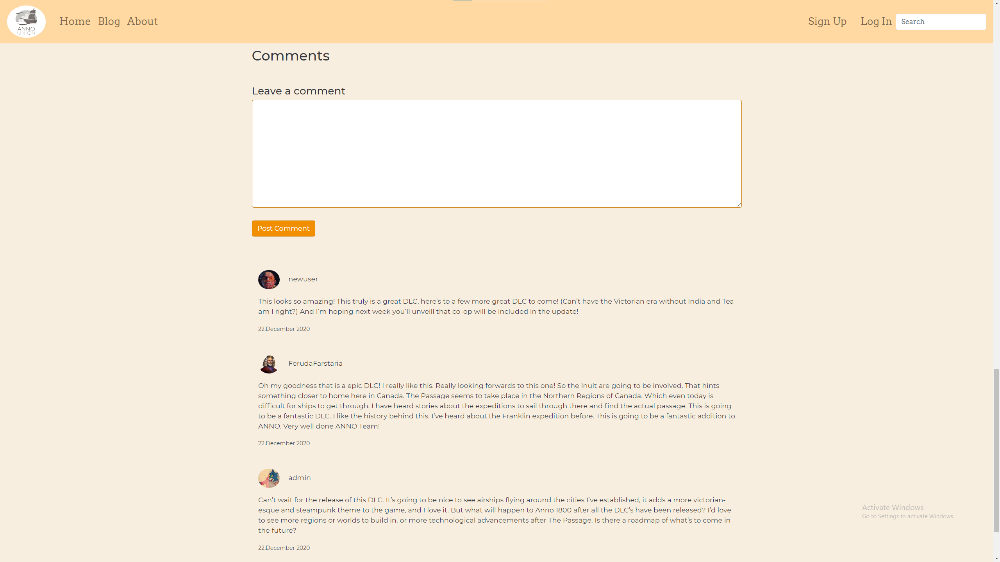

# Game Blog

## Technologies:
- Backend
  - Django 3
  - sqlite / Postgres
- Frontend
  - HTML
  - CSS
  - JavaScript
  - Bootstrap 4 

## Demo:
### Video-demo
https://youtu.be/xHn2WCXwl20

### Images

1 - Homepage [1]

2 - Homepage [2]

3 - Posts

4 - Single Post

5 - Single Post [Comments]

